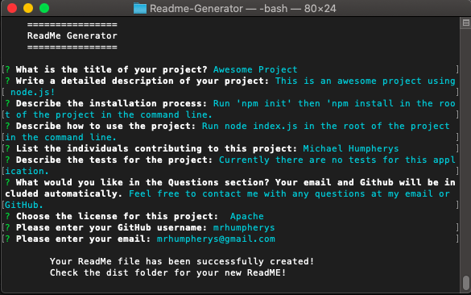

# Readme-Generator

# Description
ReadMe Generator is an interactive app using node.js, inquirer, and File System Module. When you run 'node index.js' in the command line you will be prompted to answer questions about the ReadMe you want to create. This application also allows you to choose a license for your project. After you choose a license a badge will be included at the top of the page as well as a link to the license information in the license section of the Readme. After you finish all the prompts you will recieve a message that your file has been successfully created. The new file is created in the 'dist' folder in the root of the project. A live recording of using the application can be viewed [here](https://drive.google.com/file/d/15tS7gsmoqzUWRA1rzKqAf6gnLJGNTx2M/view).

# Table of Contents
- [Installation](#installation)
- [Usage](#usage)
- [License](#license)
- [Contributing](#contributing)
- [Tests](#tests)
- [Questions](#questions)

# Installation
Run 'npm init' then 'npm install inquirer' in the root of the project in the command line.

# Usage
Run 'node index.js' in the root of the project in the command line.

# License
This project is covered by the [MIT](https://spdx.org/licenses/MIT.html) license.

# Contributing
Michael Humpherys

# Tests
Currently there are no tests for this application.

# Questions
Feel free to contact me with any questions at my email or GitHub. [Email](mailto:mrhumpherys@gmail.com), [GitHub](https://github.com/mrhumpherys)